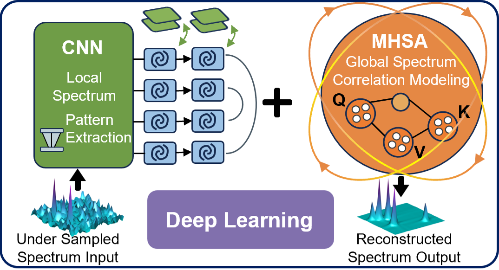

## Consistency-guided Long-range Enhanced Attention for Recon-struction (CLEAR) of Non-Uniform Sampling NMR



CLEAR is a PyTorch implementation for reconstructing nonuniformly sampled (NUS) 3D NMR spectra from hypercomplex NMRPipe data. The model leverages Conformer blocks (MHSA + depthwise separable convolution + FFN) and explicitly interleaves a Data Consistency (DC) layer between phases to preserve fidelity to acquired samples in the time/frequency domains. A complex-valued loss is optimized by computing MSE over the real and imaginary channels.

- **Architecture**: Two-phase Conformer stacks with DC layers enforcing agreement with acquired data.
- **Loss**: Complex MSE over the last dimension [real, imag].
- **I/O**: Read/write hypercomplex NMRPipe `ft1` via `nmrglue`; optional visualization uses `ft` processed by NMRPipe.
- **Author-provided trained checkpoint**: `Python code/best_model/best_model.pth` for quick evaluation.

### Repository structure

```
CLEAR/
├─ Python code/
│  ├─ model.py              # CLEAR architecture, DC layer, complex MSE
│  ├─ utils.py              # PyTorch Dataset for .mat training data
│  ├─ train.py              # Training loop, scheduler, early stopping
│  ├─ test_demo.ipynb       # Inference and optional plotting
│  ├─ best_model/
│  │  └─ best_model.pth     # Author-provided trained weights (demo)
│  ├─ NUS_Data/             # Example inputs and masks (ft1/mat)
│  └─ Recon_Results/        # Demo outputs (ft1 and post-processed ft)
├─ Matlab Code/             # MATLAB utilities (Simulated dataset generation)
└─ NMRPipe Code/            # (optional) NMRPipe macros/pipelines
```

### Installation

- Python 3.9+; PyTorch with CUDA is recommended (CPU is supported)
- Dependencies: `torch`, `numpy`, `scipy`, `nmrglue`, `matplotlib` (for plots)

PowerShell (Windows):

```bash
python -m venv .venv
. .venv/Scripts/Activate.ps1
pip install --upgrade pip
pip install torch numpy scipy nmrglue matplotlib
```

Conda:

```bash
conda create -n CLEAR python=3.10 -y
conda activate CLEAR
pip install torch numpy scipy nmrglue matplotlib
```

### Data preparation

- Hypercomplex NMRPipe examples are under `Python code/NUS_Data`, e.g.:
  - `A3DK08_nus_8.ft1`, `A3DK08_nus_10.ft1`, `A3DK08_nus_15.ft1`, `A3DK08_nus_20.ft1`
  - Masks: `A3DK08_mask_8.mat`, `A3DK08_mask_10.mat`, etc. (key `mask`)
  - Label (fully sampled) example: `A3DK08_label.ft1`
- Training `.mat` files should include the following keys (channels-last; last dim=2 for [real, imag]):
  - `f_2d_nus_2c`: frequency-domain NUS input `(H, W, 2)`
  - `fid_2d_nus_2c`: time-domain sampled signal `(H, W, 2)`
  - `f_2d_2c`: frequency-domain fully sampled target `(H, W, 2)`
  - `mask_2c`: binary sampling mask duplicated along channels `(H, W, 2)`


### Quick start (trained checkpoint)

1) Open and run `Python code/test_demo.ipynb`.
2) The notebook loads the author-provided trained checkpoint `best_model/best_model.pth`, reconstructs 8/10/15/20% sampling-rate data, and writes `.ft1` to `Python code/Recon_Results`.
3) Optional: process `.ft1` to `.ft` via supplied NMRPipe script `NMRPipe Code/proc_indirct.com`, then run the plotting cells to generate contour figures (demo `.ft` is provided for convenience).

Default working directory is `Python code/`.

### Training from scratch

`Python code/train.py` provides a minimal training script with a lambda LR scheduler, validation early stopping, and best-checkpoint saving.

Steps:
1) Edit paths near the bottom:
   - `directory`: folder containing training `.mat` files
   - `model_result_path`: path to save the best model
2) Adjust hyperparameters as needed: `model_dim`, `num_heads`, `num_layers`, `conv_kernel_size`, `dropout`, `batch_size`, `learning_rate`, `num_epochs`.
3) Run:

```bash
cd "Python code"
python train.py
```

### Method overview

- Complex spectra are represented as two real-valued channels [real, imag] (channels-last).
- Two Conformer stages are stacked; each includes MHSA, depthwise convolution, and FFN.
- DC layer: transforms to time domain, replaces acquired samples using the mask, and transforms back to enforce data fidelity.
- Loss: complex MSE (sum of MSE on real and imaginary channels).

### File formats

- Hypercomplex NMRPipe data are read/written as `.ft1` via `nmrglue.pipe.read`/`write`.
- For visualization, `.ft1` can be post-processed to `.ft` via NMRPipe; reconstruction itself does not depend on `.ft`.

### Results and performance (example)

- On the provided example and a typical GPU, reconstruction per sampling rate for a 3D dataset is ~10–12 s (indicative; hardware and size dependent).
- The notebook provides a simple RLNE metric to compare with labels.


### FAQ

- Path/casing: ensure `NUS_Data` matches notebook paths on case-sensitive systems.
- Import errors: activate the correct virtual environment and install dependencies.
- GPU memory: reduce `batch_size` or the model width (`model_dim`) during training.
